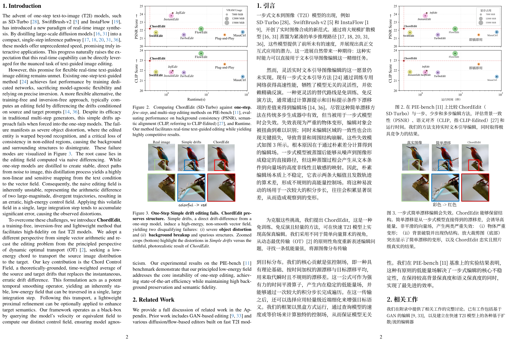

# PDF Translate Skill

A file-backed agent skill for translating technical PDFs while preserving the original PDF layout.



The example above uses page 4 of [arXiv:2602.19083v2](https://arxiv.org/abs/2602.19083v2): the original page is on the left, and the translated output generated by this skill is on the right.

## What It Does

PDF Translate Skill gives coding agents a repeatable workflow for PDF translation:

- Reads a workspace-level `pdf_translate.yaml` file.
- Uses an explicit local runtime asset directory prepared before translation.
- Runs a no-argument `advance.py` loop.
- Pauses at translation tasks by writing `current_translation.txt`.
- Lets the agent fill clean `SOURCE / TRANSLATION / END` blocks.
- Validates block structure, protected markers, and term extraction output.
- Replays accepted answers into the internal PDF pipeline.
- Generates translated PDFs while preserving layout, figures, tables, formulas, page size, and PDF structure as far as the pipeline supports.

The internal PDF pipeline is derived from BabelDOC. The skill owns the agent workflow, state model, file-task interface, validation, and output contract.

## Quick Start

### Install the skill

Clone this repository:

```bash
git clone https://github.com/JiaJunDeng5930/PDF-translate-skill.git
cd PDF-translate-skill
```

#### Codex

Codex installs personal skills under `$CODEX_HOME/skills`, which defaults to `~/.codex/skills`.

```bash
mkdir -p ~/.codex/skills
cp -R pdf-translate ~/.codex/skills/pdf-translate
```

Restart Codex after installation.

If your Codex environment has the OpenAI skill installer available, you can also install directly from GitHub:

```bash
python ~/.codex/skills/.system/skill-installer/scripts/install-skill-from-github.py \
  --repo JiaJunDeng5930/PDF-translate-skill \
  --path pdf-translate
```

#### Claude Code

Claude Code discovers personal skills from `~/.claude/skills/<skill-name>/SKILL.md` and project skills from `.claude/skills/<skill-name>/SKILL.md`.

```bash
mkdir -p ~/.claude/skills
cp -R pdf-translate ~/.claude/skills/pdf-translate
```

Run `claude` in a project and ask it to use the `pdf-translate` skill.

#### OpenCode

OpenCode discovers skills from several locations, including global `~/.config/opencode/skills/<name>/SKILL.md` and project `.opencode/skills/<name>/SKILL.md`.

Global install:

```bash
mkdir -p ~/.config/opencode/skills
cp -R pdf-translate ~/.config/opencode/skills/pdf-translate
```

Project-local install:

```bash
mkdir -p .opencode/skills
cp -R /path/to/PDF-translate-skill/pdf-translate .opencode/skills/pdf-translate
```

### Install Python dependencies

Install the runtime dependencies into the Python environment your agent will use:

```bash
python -m pip install -r pdf-translate/scripts/requirements.txt
```

### Prepare runtime assets

Download the PDF pipeline assets into a local directory:

```bash
python pdf-translate/scripts/download_assets.py ./pdf-translate-assets
```

### Minimal translation workspace

Create a folder containing your source PDF and `pdf_translate.yaml`:

```yaml
input_pdf: "paper.pdf"
lang_in: "en"
lang_out: "zh-CN"
asset_dir: "../pdf-translate-assets"
pages: null
output_mode: "mono"
watermark_output_mode: "no_watermark"
auto_extract_glossary: true
primary_font_family: null
add_formula_placehold_hint: true
```

Run the skill from that PDF workspace:

```bash
python /path/to/pdf-translate/scripts/advance.py
```

When the result returns `needs_ai_edit` or `needs_ai_fix`, edit the returned `current_translation.txt`, save it, and run `advance.py` again. Repeat until the result returns `done`.

## Usage

Typical agent workflow:

1. Prepare runtime assets with `download_assets.py`.
2. Create `pdf_translate.yaml` in the PDF workspace.
3. Run `advance.py` from that workspace.
4. Fill every `TRANSLATION` block in `current_translation.txt`.
5. Keep every `SOURCE` block unchanged.
6. Preserve protected markers such as `FORMULA`, `INLINE_MATH`, and `PROTECTED_TEXT`.
7. Run `advance.py` again.
8. Use `output_pdf` or `output_pdfs` from the final JSON result.

The runtime writes program-owned state under `.pdf_translate/`. Translation-stage editing is limited to `current_translation.txt`.

## Architecture

The repository has five important layers:

- `pdf-translate/SKILL.md`: the agent-facing skill entrypoint.
- `pdf-translate/scripts/advance.py`: the public no-argument runtime entrypoint.
- `pdf-translate/scripts/download_assets.py`: explicit asset preparation entrypoint.
- `pdf-translate/scripts/file_task_pdf_translate/`: config parsing, state, editable file rendering, validation, answer replay, and output reporting.
- `pdf-translate/scripts/babeldoc/`: BabelDOC-derived internal PDF pipeline for parsing, layout analysis, formula/style handling, font mapping, typesetting, local asset loading, and PDF generation.

Runtime flow:

```text
pdf_translate.yaml
  -> advance.py
  -> validate local asset_dir
  -> freeze config into .pdf_translate/state.json
  -> run internal PDF pipeline
  -> pause at term/translation task
  -> write current_translation.txt
  -> validate accepted answer
  -> replay answer by task hash
  -> generate translated PDF
```

## Limitations

- Translation quality depends on the agent filling `current_translation.txt`; runtime validation checks structure and protected markers, not semantic accuracy.
- The file-task loop is sequential.
- Output fidelity depends on the internal PDF pipeline and the source PDF structure.
- Scanned/OCR-heavy PDFs may need pipeline options that are not currently exposed in `pdf_translate.yaml`.
- Large PDFs can require many `advance.py` iterations.
- Runtime dependencies are installed separately; they are not bundled in this repository.
- Runtime assets are prepared separately with `download_assets.py`.

## Development

Create a virtual environment and install dependencies:

```bash
python -m venv .venv
source .venv/bin/activate
python -m pip install -r pdf-translate/scripts/requirements.txt
```

On Windows PowerShell:

```powershell
python -m venv .venv
.\.venv\Scripts\Activate.ps1
python -m pip install -r pdf-translate\scripts\requirements.txt
```

Run tests:

```bash
python -m unittest discover -s tests
```

Run a syntax/import check:

```bash
python -m compileall -q pdf-translate/scripts/file_task_pdf_translate pdf-translate/scripts/babeldoc pdf-translate/scripts/download_assets.py
```

Validate the skill layout with the Codex skill-creator quick validator when available:

```bash
python ~/.codex/skills/.system/skill-creator/scripts/quick_validate.py pdf-translate
```

Release artifacts are the tracked source tree. Users install Python dependencies and prepare runtime assets with `download_assets.py`.

For runtime changes, test with a real PDF containing text, formulas, figures, and tables. Render the source and translated pages side by side before accepting layout-sensitive changes.

## Contributing

Contributions should keep the public contract stable:

- `pdf-translate/scripts/advance.py` remains the public no-argument entrypoint.
- `pdf_translate.yaml` remains the translation task config file.
- `current_translation.txt` remains the only AI-editable file during translation tasks.
- Program-owned state remains under `.pdf_translate/`.
- BabelDOC-derived files that are modified must retain AGPL headers and prominent modification notices.
- Third-party source or dependency changes must update `THIRD_PARTY_LICENSES.md`.

Before opening a change, run the unit tests, compile check, and a real-PDF layout validation for runtime changes.

## License

This project is licensed under `AGPL-3.0-or-later`; see [LICENSE](LICENSE).

The internal PDF pipeline is derived from BabelDOC. Upstream attribution and modification notes are in [pdf-translate/references/babeldoc-upstream.md](pdf-translate/references/babeldoc-upstream.md), and third-party notices are in [THIRD_PARTY_LICENSES.md](THIRD_PARTY_LICENSES.md).
